```mermaid
flowchart TD
    start_node([Start])

    %% Step 1 - Image Intake & Configuration
    step1_intake[Step 1.1: Image Upload & Multi-Image Support]
    step1_resolution[Step 1.2: Resolution Gate & Auto-Upscale]
    step1_config[Step 1.3: User Configuration Menu]

    %% Step 2 - Deep Image Analysis
    step2_analysis[Step 2: Deep Image Analysis]
    subagent_analyzer[[Spawn: image-analyzer]]
    checkpoint1{AskUserQuestion: Confirm Analysis}

    %% Step 3 - Multi-View Synthesis
    step3_views[Step 3: Multi-View Synthesis]
    subagent_viewgen[[Spawn: view-generator]]
    checkpoint2{AskUserQuestion: Confirm Views}

    %% Step 4 - 3D Reconstruction
    step4_mesh[Step 4: 3D Reconstruction]
    subagent_meshgen[[Spawn: mesh-generator]]
    checkpoint3{AskUserQuestion: Confirm Mesh}

    %% Step 5 - Print Preparation
    step5_print[Step 5: Print Preparation]
    subagent_printopt[[Spawn: print-optimizer]]
    checkpoint4{AskUserQuestion: Confirm Print Prep}

    %% Step 6 - Export
    step6_export[Step 6: Export & Delivery]
    subagent_exporter[[Spawn: file-exporter]]

    end_node([End])

    %% Flow connections
    start_node --> step1_intake
    step1_intake --> step1_resolution
    step1_resolution --> step1_config
    step1_config --> subagent_analyzer
    subagent_analyzer --> step2_analysis
    step2_analysis --> checkpoint1

    checkpoint1 -->|Confirmed| subagent_viewgen
    checkpoint1 -->|Corrections| step2_analysis

    subagent_viewgen --> step3_views
    step3_views --> checkpoint2

    checkpoint2 -->|Confirmed| subagent_meshgen
    checkpoint2 -->|Regenerate Views| step3_views
    checkpoint2 -->|Upload Reference| step1_intake

    subagent_meshgen --> step4_mesh
    step4_mesh --> checkpoint3

    checkpoint3 -->|Approved| subagent_printopt
    checkpoint3 -->|Request Changes| step4_mesh
    checkpoint3 -->|Try Alternative| subagent_meshgen

    subagent_printopt --> step5_print
    step5_print --> checkpoint4

    checkpoint4 -->|Approved| subagent_exporter
    checkpoint4 -->|Adjust Settings| step5_print
    checkpoint4 -->|Return to Mesh| step4_mesh

    subagent_exporter --> step6_export
    step6_export --> end_node
```

## Workflow Execution Guide

Follow the Mermaid flowchart above to execute the workflow. Each node type has specific execution methods as described below.

### Execution Methods by Node Type

- **Rectangle nodes**: Execute the prompts described in the details section below
- **Double-bracket nodes [[...]]**: Spawn Sub-Agents using the Task tool
- **Diamond nodes (AskUserQuestion:...)**: Use the AskUserQuestion tool to prompt the user and branch based on their response
- **Diamond nodes (Branch/Switch:...)**: Automatically branch based on the results of previous processing

---

## Prompt Node Details

### step1_intake (Step 1.1: Image Upload & Multi-Image Support)

```
STEP 1.1 — IMAGE UPLOAD & MULTI-IMAGE SUPPORT

Accept image upload from the user. Support common formats: PNG, JPG, JPEG, WEBP, TIFF, BMP.

Display option: "Would you like to upload additional reference images from other angles? (Optional but recommended—more angles = more accurate results)"

If user uploads multiple images (2-5), register them as a reference set and note which angles they represent.

Store the following in workflow state:
- {{primaryImage}}: Path to main input image
- {{referenceImages}}: Array of additional reference image paths (if any)
- {{imageAngles}}: Mapping of which angle each image represents
```

---

### step1_resolution (Step 1.2: Resolution Gate & Auto-Upscale)

```
STEP 1.2 — RESOLUTION GATE & AUTO-UPSCALE

Analyze input image resolution for {{primaryImage}} and all {{referenceImages}}.

If the longest edge is below 1024px:
- Automatically upscale using AI upscaling to at least 1024px (preserve detail, reduce artifacts)
- Notify user: "Input image was low resolution. Auto-upscaled to [X]px for better detail extraction."

If multiple images uploaded, apply resolution gate to each.

Store in workflow state:
- {{imageResolution}}: Final resolution after any upscaling
- {{wasUpscaled}}: Boolean indicating if upscaling was applied
```

---

### step1_config (Step 1.3: User Configuration Menu)

```
STEP 1.3 — USER CONFIGURATION MENU

Present configuration options using AskUserQuestion tool with the following questions:

QUESTION 1 - Processing Mode:
- "Single subject" — Focus on one primary object/person
- "Full scene" — Process all objects in the scene as a unified model
- "Full scene (separate objects)" — Process all objects but export as individual meshes

QUESTION 2 - Detail Level:
- "Standard" — Balanced quality and processing time, suitable for most prints
- "High" — Increased polygon density, captures finer surface details
- "Ultra" — Maximum detail with subdivision surfaces, micro-geometry preservation, best for resin printing or display pieces

QUESTION 3 - Target Material:
- "PLA/FDM" — Optimize for filament printing (thicker walls, simplified fine details)
- "Resin/SLA" — Optimize for resin printing (finer details preserved, drainage holes)
- "Nylon/SLS" — Optimize for powder printing (interlocking parts OK, no supports needed)
- "Display only" — No print optimization, maximum visual fidelity

QUESTION 4 - Target Use:
- "Display model" — Prioritize visual accuracy
- "Functional print" — Prioritize structural strength
- "Miniature" — Scale-appropriate detail reduction, reinforced thin parts
- "Large format" — Auto-split for bed size limits, add alignment keys

QUESTION 5 - Scale Specification:
- "Auto-detect from image context"
- "Specify dimensions" — User inputs desired height/width/depth
- "Fit to print bed" — User specifies bed size, model scales to fit

Store all configuration choices:
- {{processingMode}}
- {{detailLevel}}
- {{targetMaterial}}
- {{targetUse}}
- {{scaleSpec}}
```

---

### subagent_analyzer (Spawn: image-analyzer)

```
SPAWN SUBAGENT: image-analyzer

Use the Task tool with subagent_type="general-purpose" to spawn an image analysis agent.

Agent prompt:
"You are an image-analyzer subagent for the image-to-3d-print workflow.

Analyze the provided image(s) and generate a comprehensive breakdown:

INPUT:
- Primary image: {{primaryImage}}
- Reference images: {{referenceImages}}
- Processing mode: {{processingMode}}
- Detail level: {{detailLevel}}

TASKS TO COMPLETE:

2.1 — OBJECT DETECTION & SEGMENTATION
- Identify all distinct objects/elements in the scene
- Generate segmentation masks for each element
- Determine hierarchical relationships (e.g., person → clothing → belt → buckle)
- Identify primary subject vs. background elements

2.2 — SURFACE DETAIL INVENTORY
For each identified element, catalog ALL visible surface details:
- Textures (fabric weave, skin pores, wood grain, metal brushing)
- Protrusions (buttons, buckles, jewelry, zippers, rivets, raised patterns, embroidery)
- Recessions (folds, wrinkles, seams, stitching, carved details, pockets)
- Accessories (glasses, watches, earrings, belts, scarves, bags, weapons, tools)
- Hair/fur (volume, flow direction, strand groupings, length variation)
- Clothing details (collar style, sleeve type, hem, pleats, layering)
- Facial features (if applicable): eye depth, nose shape, lip definition, ear structure, brow ridge
- Hand/finger positioning (if applicable): joint angles, nail visibility, grip on objects

Rate each detail's dimensional significance: 'Flat texture only,' 'Subtle relief,' 'Moderate protrusion,' 'Significant 3D feature'

2.3 — MATERIAL INFERENCE
For each element, infer likely real-world material:
- Metal (shiny, brushed, matte, rusted)
- Fabric (cotton, leather, silk, denim, wool, synthetic)
- Skin (human, animal)
- Plastic/rubber, Wood, Glass/transparent (flag for special handling), Stone/concrete, Organic

2.4 — DEPTH ESTIMATION
Generate a depth map from the input image(s):
- Use monocular depth estimation for single images
- Use stereo/multi-view depth if multiple angles provided
- Output: Grayscale depth map with near=white, far=black
- Identify depth discontinuities (edges of objects)

2.5 — OCCLUSION MAPPING
Identify all areas not visible in the input:
- Back of subject, underside, interior spaces, areas blocked by other elements
- Note what's likely there based on context
- Rate confidence level (high/medium/low)
- Note whether user reference images cover this area

2.6 — SCALE ESTIMATION (if auto-detect selected)
- Look for reference objects with known sizes
- Estimate real-world dimensions
- Flag if no reliable reference found

2.7 — DIFFICULT SUBJECT DETECTION
Flag and tag any challenging elements:
- Transparent/translucent objects
- Highly reflective surfaces
- Very thin elements (hair strands, wires, fur)
- Complex overlapping objects
- Motion blur or out-of-focus areas

OUTPUT FORMAT:
Return a structured analysis report with all findings, ready for user review at checkpoint."
```

---

### step2_analysis (Step 2: Deep Image Analysis)

```
STEP 2 — DEEP IMAGE ANALYSIS RESULTS

Process and format the output from the image-analyzer subagent.

Present complete analysis to user:
- Annotated image showing detected elements and details
- List of all catalogued features organized by category
- Material inference results
- Depth map visualization
- Flagged challenges and recommendations
- Scale estimation (if applicable)

Store analysis results in workflow state:
- {{detectedObjects}}: Array of identified objects with segmentation data
- {{surfaceDetails}}: Comprehensive detail inventory
- {{materialMap}}: Material inference per element
- {{depthMap}}: Generated depth map data
- {{occlusionMap}}: Areas requiring synthesis
- {{estimatedScale}}: Real-world dimensions (if determined)
- {{flaggedIssues}}: Challenging elements requiring attention
```

---

### checkpoint1 (AskUserQuestion: Confirm Analysis)

```
USER CHECKPOINT #1 — ANALYSIS CONFIRMATION

Use the AskUserQuestion tool to present the analysis and get user confirmation.

Question: "Here's what I detected in your image. Please review the analysis:"

Show:
- Annotated image with detected elements
- Complete feature inventory
- Flagged issues and recommendations

Options:
1. "Confirm and proceed" — Analysis is accurate, continue to view synthesis
2. "Add corrections" — User provides corrections or additional details to capture
3. "Re-analyze with different settings" — Restart analysis with modified parameters

If user selects "Add corrections":
- Collect their corrections
- Update {{detectedObjects}}, {{surfaceDetails}}, etc.
- Re-present analysis for confirmation

Branch based on response:
- Confirmed → Continue to subagent_viewgen
- Corrections → Return to step2_analysis with updates
```

---

### subagent_viewgen (Spawn: view-generator)

```
SPAWN SUBAGENT: view-generator

Use the Task tool with subagent_type="general-purpose" to spawn a view synthesis agent.

Agent prompt:
"You are a view-generator subagent for the image-to-3d-print workflow.

Generate synthesized multi-angle views of the subject for 3D reconstruction.

INPUT:
- Primary image: {{primaryImage}}
- Reference images: {{referenceImages}}
- Analysis results: {{detectedObjects}}, {{surfaceDetails}}, {{depthMap}}, {{occlusionMap}}
- Detail level: {{detailLevel}}

TASKS TO COMPLETE:

3.1 — REFERENCE VIEW REGISTRATION
If user provided multiple reference images:
- Determine the angle of each image (front, side, 3/4, etc.)
- Align images to common scale and orientation
- Use these as ground truth for their respective angles

3.2 — VIEW GENERATION STRATEGY
Determine which views need to be synthesized:

Required views for complete 360° coverage:
- Front (0°), Front-right (45°), Right (90°), Back-right (135°)
- Back (180°), Back-left (225°), Left (270°), Front-left (315°)
- Top, Bottom
- Top-front (45° elevated), Top-back (45° elevated from rear)

Mark each as: 'Provided', 'Partial', or 'Synthesize'

3.3 — CONSISTENT VIEW SYNTHESIS
For each view marked 'Synthesize', generate ensuring:
- Consistent lighting direction matching input image(s)
- Identical proportions and scale
- All detected surface details appear correctly from that angle
- Protrusions and accessories wrap logically around the subject
- Symmetry where expected (both ears match, both shoes match unless input shows otherwise)
- Clothing/fabric flow continues naturally to unseen areas
- Hair volume is consistent in 3D space

Use the depth map to inform occlusion and parallax.

3.4 — OCCLUSION INPAINTING
For fully hidden areas (back, underside):
- Use context from visible areas to infer hidden geometry
- Apply learned priors (humans have backs similar to fronts, etc.)
- Generate conservative estimates for ambiguous areas
- Flag low-confidence areas

3.5 — DETAIL CONSISTENCY PASS
After initial synthesis, run consistency check:
- Verify details visible in one view are correctly positioned in all views
- Check that no details 'teleport' between views
- Ensure protrusions cast consistent shadows
- Validate object boundaries align across adjacent views

If inconsistencies detected, regenerate affected views.

OUTPUT:
- All synthesized views as individual images
- Animated rotation preview (GIF) cycling through all angles
- Confidence overlay showing high-confidence vs. inferred areas
- List of any views with synthesis issues"
```

---

### step3_views (Step 3: Multi-View Synthesis)

```
STEP 3 — MULTI-VIEW SYNTHESIS RESULTS

Process and format the output from the view-generator subagent.

Compile synthesized views:
- All 12+ angle views (provided + synthesized)
- Rotation preview animation
- Confidence map overlay
- Notes on any problem areas

Store in workflow state:
- {{synthesizedViews}}: Array of all view images with angle labels
- {{rotationPreview}}: Animated preview file
- {{viewConfidenceMap}}: Confidence ratings per view/region
- {{viewIssues}}: Any flagged synthesis problems
```

---

### checkpoint2 (AskUserQuestion: Confirm Views)

```
USER CHECKPOINT #2 — VIEW CONFIRMATION

Use the AskUserQuestion tool to present synthesized views.

Question: "Here are the synthesized views from all angles. Please review:"

Show:
- Rotation preview animation (GIF)
- Grid of all individual angle views
- Confidence overlay highlighting inferred areas

Options:
1. "Confirm all views" — Views look correct, proceed to 3D reconstruction
2. "Regenerate specific views" — User identifies which angles need work
3. "Upload additional reference for problem areas" — User provides more reference images

If user selects "Regenerate specific views":
- Collect which views need regeneration
- Return to step3_views with those views flagged for re-synthesis

If user selects "Upload additional reference":
- Return to step1_intake to add new reference images
- Re-run analysis and view synthesis with new data

Branch based on response:
- Confirmed → Continue to subagent_meshgen
- Regenerate → Return to step3_views
- Upload Reference → Return to step1_intake
```

---

### subagent_meshgen (Spawn: mesh-generator)

```
SPAWN SUBAGENT: mesh-generator

Use the Task tool with subagent_type="general-purpose" to spawn a 3D reconstruction agent.

Agent prompt:
"You are a mesh-generator subagent for the image-to-3d-print workflow.

Generate a high-quality 3D mesh from the synthesized multi-view images.

INPUT:
- Synthesized views: {{synthesizedViews}}
- Depth map: {{depthMap}}
- Surface details: {{surfaceDetails}}
- Detail level: {{detailLevel}}
- Target material: {{targetMaterial}}

TASKS TO COMPLETE:

4.1 — MULTI-METHOD RECONSTRUCTION
Run 2-3 reconstruction methods in parallel:

Method A — Multi-View Stereo (MVS)
- Triangulate points from corresponding features across views
- Good for sharp edges and hard surfaces

Method B — Neural Radiance Field (NeRF) or Gaussian Splatting
- Learn volumetric representation from views
- Good for complex organic shapes and soft surfaces

Method C — Diffusion-based 3D generation
- Use trained 3D diffusion model conditioned on input views
- Good for plausible detail hallucination

For each method, generate:
- Raw point cloud
- Initial mesh
- Quality score (geometric accuracy, surface smoothness, detail preservation)

4.2 — METHOD FUSION / SELECTION
Compare results from all methods:
- Score each for: geometric accuracy, detail preservation, surface smoothness, watertightness
- Either select the best overall result OR fuse the best aspects of each

4.3 — GEOMETRY/DETAIL SEPARATION
Process in three distinct passes:

Pass 1 — Base Geometry
- Generate clean, accurate base mesh capturing overall shape
- Focus on correct proportions, silhouette accuracy, major volumes
- Polygon count appropriate for 'Standard' detail level

Pass 2 — Detail Sculpting
- Add fine surface details based on surface detail inventory
- Wrinkles, folds, small protrusions, surface texture depth
- For 'High' detail: Increase polygon density 2-4x in detail areas
- For 'Ultra' detail: Subdivision surfaces with displacement mapping

Pass 3 — Micro-Detail (Ultra mode only)
- Skin pores, fabric weave, metal scratches as geometric detail
- Hair strand clumps as geometry
- Fine jewelry details fully modeled

4.4 — DETAIL PRESERVATION CHECKLIST
Verify all catalogued details from analysis are present:
- All protrusions modeled (buttons, buckles, accessories)
- All recessions modeled (folds, wrinkles, seams)
- Hair volume matches reference
- Facial features have correct depth
- Hands/fingers correctly posed (if applicable)
- Clothing layering represented
- Accessories properly attached and positioned

4.5 — MESH TOPOLOGY OPTIMIZATION
- Retopologize for even polygon distribution
- Remove internal faces
- Merge duplicate vertices
- Fix normal directions (all facing outward)
- Reduce polygon count in low-detail areas

4.6 — AUTOMATED MESH VALIDATION
Run validation checks:

Geometry Issues:
- Non-manifold edges, Non-manifold vertices, Zero-area faces
- Self-intersecting geometry, Floating/disconnected geometry, Holes in mesh

Printability Issues (based on target material):
- Thin walls below material minimum
- Sharp points that won't print
- Overhangs exceeding 45° (mark support needs)
- Very thin details that may break

For each issue: identify location, classify severity, suggest fix

4.7 — LEVEL OF DETAIL GENERATION
Create 3 LOD versions:
- LOD-Print: Full detail for final export
- LOD-Preview: 10-20% polygon count for interactive preview
- LOD-Thumbnail: 1-5% polygon count for file browsers

4.8 — TEXTURE MAP GENERATION
Generate texture maps:
- Diffuse/Albedo map — Color information
- Normal map — Surface detail for visual rendering
- Roughness map — Material shininess variation
- Ambient occlusion map — Soft shadowing in crevices

UV unwrap the mesh and project textures. Inpaint texture for synthesized areas.

OUTPUT:
- Primary mesh (best reconstruction method)
- Alternative meshes (other methods)
- All LOD versions
- Texture maps
- Validation report with issues and locations
- Interactive 3D preview data"
```

---

### step4_mesh (Step 4: 3D Reconstruction)

```
STEP 4 — 3D RECONSTRUCTION RESULTS

Process and format the output from the mesh-generator subagent.

Prepare for user review:
- Interactive 3D preview (LOD-Preview mesh)
- Validation report with any issues flagged
- Reconstruction method comparison
- Detail preservation checklist results

Store in workflow state:
- {{primaryMesh}}: Best reconstruction result
- {{alternativeMeshes}}: Other method results
- {{lodMeshes}}: LOD-Print, LOD-Preview, LOD-Thumbnail
- {{textureMaps}}: Diffuse, normal, roughness, AO maps
- {{validationReport}}: Geometry and printability issues
- {{reconstructionMethod}}: Method used for primary mesh
```

---

### checkpoint3 (AskUserQuestion: Confirm Mesh)

```
USER CHECKPOINT #3 — MESH CONFIRMATION

Use the AskUserQuestion tool to present the 3D model.

Question: "Here's your reconstructed 3D model. Please review:"

Show:
- Interactive 3D viewer (user can rotate, zoom, pan)
- Validation warnings if any
- Reconstruction method used
- Detail checklist results

Options:
1. "Approve and continue to print prep" — Mesh looks good, proceed
2. "Request changes" — User specifies what needs adjustment
3. "Try alternative method" — User wants to see results from a different reconstruction method

If user selects "Request changes":
- Collect specific change requests
- Return to step4_mesh to apply adjustments

If user selects "Try alternative method":
- Show alternative meshes from {{alternativeMeshes}}
- Let user select preferred result or request fusion

Branch based on response:
- Approved → Continue to subagent_printopt
- Request Changes → Return to step4_mesh
- Try Alternative → Return to subagent_meshgen
```

---

### subagent_printopt (Spawn: print-optimizer)

```
SPAWN SUBAGENT: print-optimizer

Use the Task tool with subagent_type="general-purpose" to spawn a print optimization agent.

Agent prompt:
"You are a print-optimizer subagent for the image-to-3d-print workflow.

Prepare the 3D mesh for optimal 3D printing.

INPUT:
- Primary mesh: {{primaryMesh}}
- Target material: {{targetMaterial}}
- Target use: {{targetUse}}
- Scale specification: {{scaleSpec}}
- Validation report: {{validationReport}}

TASKS TO COMPLETE:

5.1 — WATERTIGHT VERIFICATION
Ensure mesh is completely watertight (printable):
- Fill all holes identified in validation
- Bridge gaps, close open edges
- Verify mesh is a single closed volume (or intentional separate pieces)

5.2 — ISSUE AUTO-REPAIR
For all flagged issues, apply automatic fixes:
- Non-manifold edges → Remove or rebuild affected faces
- Self-intersection → Boolean union with self
- Thin walls → Thicken to minimum for target material
- Tiny holes → Fill and smooth
- Sharp points → Fillet/round to printable radius
- Floating geometry → Remove if tiny, keep if intentional

Log all repairs made.

5.3 — PRINT ORIENTATION OPTIMIZATION
Analyze and recommend optimal print orientation.

Calculate for each candidate orientation:
- Support material volume needed
- Support contact points on model surface
- Largest cross-section (affects adhesion)
- Layer line visibility on key surfaces
- Structural strength along weak points

Present top 3 orientations with:
- Preview render showing supports
- Estimated support volume
- Surface quality assessment

5.4 — MATERIAL-SPECIFIC OPTIMIZATION
Apply adjustments based on target material:

PLA/FDM:
- Minimum wall thickness: 1.2mm
- Minimum detail size: 0.8mm
- Add fillets to sharp internal corners

Resin/SLA:
- Minimum wall thickness: 0.5mm
- Minimum detail size: 0.2mm
- Add drainage holes for hollow prints (2mm minimum)
- Add vent holes to prevent suction

Nylon/SLS:
- Minimum wall thickness: 0.7mm
- Minimum detail size: 0.5mm
- No supports needed

5.5 — HOLLOWING (if appropriate)
Based on target use and material:

For 'Display model' + Resin:
- Hollow with 2mm wall thickness
- Add 2 drainage holes in hidden areas
- Add internal support ribs for large flat areas

For 'Functional print': Keep solid or use infill
For 'Miniature': Keep solid
For 'Large format': Hollow with 3-4mm walls, add ribbing

5.6 — SPLITTING FOR LARGE MODELS
If model exceeds typical print bed (256mm³) OR 'Large format' selected:
- Analyze for optimal split planes (natural seams, hidden areas)
- Split into sections that fit target bed
- Add alignment features: pin holes, keyed surfaces, assembly labels
- Generate assembly guide

5.7 — STRUCTURAL ANALYSIS
For 'Functional print' target:
- Identify thin/weak points likely to break
- Suggest reinforcement (thickening, internal ribs)
- Warn about areas that may fail

5.8 — PRINTABILITY REPORT
Generate comprehensive report:

Model Statistics:
- Final vertex/face count
- Bounding box dimensions (mm)
- Total volume (cm³), surface area (cm²)
- Watertight status
- Repairs made

Print Estimates (recommended orientation):
- Print time at 0.1mm, 0.2mm, 0.3mm layer heights
- Material usage estimates

Recommendations:
- Best orientation, suggested infill, support requirements
- Post-processing suggestions

OUTPUT:
- Print-optimized mesh
- Orientation analysis with renders
- Hollowed variant (if applicable)
- Split pieces with assembly guide (if applicable)
- Complete printability report"
```

---

### step5_print (Step 5: Print Preparation)

```
STEP 5 — PRINT PREPARATION RESULTS

Process and format the output from the print-optimizer subagent.

Compile print-ready outputs:
- Optimized mesh with all repairs applied
- Orientation analysis with top 3 recommendations
- Hollowed version (if generated)
- Split pieces and assembly guide (if applicable)
- Complete printability report

Store in workflow state:
- {{printReadyMesh}}: Final optimized mesh
- {{orientationAnalysis}}: Recommended orientations with renders
- {{hollowedMesh}}: Hollowed variant (if applicable)
- {{splitPieces}}: Array of split pieces (if applicable)
- {{assemblyGuide}}: Assembly instructions (if split)
- {{printabilityReport}}: Complete print statistics and estimates
- {{repairsApplied}}: Log of all automatic repairs
```

---

### checkpoint4 (AskUserQuestion: Confirm Print Prep)

```
USER CHECKPOINT #4 — PRINT PREPARATION CONFIRMATION

Use the AskUserQuestion tool to present the printability report.

Question: "Your model is prepared for printing. Please review the printability report:"

Show:
- Complete printability report
- Recommended orientation with support preview
- Model statistics and print estimates
- Any remaining warnings

Options:
1. "Approve and export" — Ready for final export
2. "Adjust orientation" — User wants different print orientation
3. "Modify hollowing/splitting" — User wants to change hollow or split settings
4. "Return to mesh editing" — User wants to make mesh changes

If user selects "Adjust orientation":
- Show all orientation options
- Let user select preferred orientation
- Re-calculate estimates for new orientation

If user selects "Modify hollowing/splitting":
- Present hollowing/splitting options
- Apply changes and re-run print prep

Branch based on response:
- Approved → Continue to subagent_exporter
- Adjust Settings → Return to step5_print with new parameters
- Return to Mesh → Return to step4_mesh
```

---

### subagent_exporter (Spawn: file-exporter)

```
SPAWN SUBAGENT: file-exporter

Use the Task tool with subagent_type="general-purpose" to spawn an export agent.

Agent prompt:
"You are a file-exporter subagent for the image-to-3d-print workflow.

Generate all export files and preview assets.

INPUT:
- Print-ready mesh: {{printReadyMesh}}
- Hollowed mesh: {{hollowedMesh}}
- Split pieces: {{splitPieces}}
- Texture maps: {{textureMaps}}
- Printability report: {{printabilityReport}}
- Assembly guide: {{assemblyGuide}}
- Original image: {{primaryImage}}

TASKS TO COMPLETE:

6.1 — GENERATE ALL FORMAT VARIANTS

STL Export (for slicers):
- Binary STL format (smaller file size)
- Single mesh, optimized for slicer compatibility
- One file per print piece (if split)
- Naming: [modelname]_print.stl

OBJ Export (with materials):
- OBJ geometry file
- MTL material library file
- Texture maps (diffuse, normal, roughness, AO) as PNG
- Naming: [modelname].obj, [modelname].mtl

GLTF/GLB Export (for sharing/preview):
- GLB binary format (single file with embedded textures)
- GLTF + separate files as alternative
- Naming: [modelname].glb

6.2 — GENERATE MODEL VARIANTS

Solid version: [modelname]_solid.stl
Hollowed version: [modelname]_hollow.stl (if applicable)
Split version: [modelname]_split_part[N].stl (if applicable)
Simplified version: [modelname]_simplified.stl (50% reduced)

6.3 — GENERATE PREVIEW ASSETS

Turntable render:
- 360° rotation animation
- GIF and MP4 formats
- 5-10 seconds duration
- [modelname]_turntable.gif/mp4

Comparison render:
- Side-by-side: original image | 3D render from same angle
- [modelname]_comparison.png

Thumbnail:
- 512x512px static render
- [modelname]_thumb.png

Print preview:
- Recommended orientation with supports shown
- [modelname]_print_preview.png

6.4 — GENERATE DOCUMENTATION

Assembly guide (if split): [modelname]_assembly_guide.pdf
Print settings card: [modelname]_print_settings.txt

6.5 — EMBED METADATA
Embed into file metadata:
- Source workflow identifier
- Processing settings used
- Scale reference
- Creation date
- Recommended print settings

6.6 — PACKAGE OUTPUT
Create organized output structure:

[modelname]/
├── print_ready/
│   ├── [modelname]_solid.stl
│   ├── [modelname]_hollow.stl
│   └── [modelname]_split_part[N].stl
├── full_detail/
│   ├── [modelname].obj
│   ├── [modelname].mtl
│   ├── [modelname].glb
│   └── textures/
├── preview/
│   ├── [modelname]_turntable.gif
│   ├── [modelname]_comparison.png
│   └── [modelname]_thumb.png
├── documentation/
│   ├── [modelname]_print_settings.txt
│   └── processing_log.txt
└── README.txt

Also provide single ZIP download.

OUTPUT:
- Complete file package
- Individual download links
- Turntable preview for final display"
```

---

### step6_export (Step 6: Export & Delivery)

```
STEP 6 — EXPORT & FINAL DELIVERY

Present final outputs to user:

"Your 3D model is complete!

Quick Preview:
[Embedded turntable GIF]

Comparison to Original:
[Side-by-side comparison image]

Downloads:
- [Download All (ZIP)] — Complete package with all formats
- [STL for Printing] — Print-ready file only
- [GLB for Sharing] — Web/AR preview format
- [OBJ with Textures] — Full quality with materials

Print this model:
- Recommended layer height: [X]mm
- Estimated print time: [Y] hours
- Material needed: [Z]g

[View full printability report]

What would you like to do next?
- [Start new model]
- [Modify this model]
- [Adjust export settings]"

Workflow complete.
```

---

## Failure Recovery Protocols

Apply these recovery protocols throughout the workflow:

### View Synthesis Failure
```
If view synthesis fails for a specific angle:
1. Attempt regeneration with reduced detail level
2. If still fails, flag that specific angle
3. Ask user: "I'm having trouble generating the [back] view. Can you upload a reference photo from that angle, or should I proceed with my best estimate?"
4. Continue with available views rather than full abort
5. Mark low-confidence regions in final mesh
```

### Mesh Reconstruction Failure
```
If mesh reconstruction fails:
1. Attempt with alternative reconstruction method
2. If partial success, isolate problem region
3. Offer options: "The [left arm] region has geometry issues. I can:
   [A] Simplify that area
   [B] Generate it as a separate piece for manual attachment
   [C] Wait for you to provide a clearer reference image"
4. Continue with successful regions
```

### Non-Repairable Geometry
```
If mesh has non-repairable geometry:
1. Isolate problem areas
2. Attempt localized regeneration
3. If unfixable, offer to remove problem feature or replace with simplified geometry
4. Document issues for user awareness
```

### Critical Print Prep Issues
```
If print prep detects critical issues:
1. Clearly explain the issue and its impact
2. Offer automatic fix if possible
3. If no auto-fix, suggest manual solutions
4. Allow user to proceed with warnings if they understand the risk
```

### Special Case Handling
```
Transparent/glass objects:
- Pause and ask: "I've detected what appears to be a transparent or reflective surface. Please describe what this object actually looks like."

Very thin elements (hair, fur, wires):
- Alert user: "This element is [X]mm thin, below printable threshold. Options:
  [A] Thicken to [Y]mm for printability
  [B] Represent as texture only (flat)
  [C] Remove from print
  [D] Keep as-is for display-only model"

Multiple overlapping subjects:
- Offer: "[A] Process as single unified scene
         [B] Separate into individual models
         [C] Let me show detected subjects so you can choose"

Low-quality input:
- Warn: "The input image has significant artifacts/noise/blur. This will affect detail accuracy. Proceed anyway or upload better image?"
```

---

## Progress & Logging

Throughout the workflow:
- Display current step and progress percentage
- Show estimated time remaining
- Provide cancel button at all times
- Allow pause and resume

Log format:
```
[timestamp] Step 1.1: Image uploaded - filename.jpg (2048x1536px)
[timestamp] Step 1.2: Resolution check passed
[timestamp] Step 1.3: User config - Mode: Single subject, Detail: High, Material: Resin
[timestamp] Step 2.1: Object detection complete - 1 primary subject, 12 detail features
...
[timestamp] Export complete - 8 files generated
```

Save log to processing_log.txt in output folder.

---

## Subagent Summary

| Subagent | Primary Responsibility | Spawned At |
|----------|----------------------|------------|
| image-analyzer | Deep analysis, segmentation, depth estimation, detail cataloging | Step 2 |
| view-generator | Multi-view synthesis, occlusion inpainting, consistency checking | Step 3 |
| mesh-generator | 3D reconstruction, detail sculpting, topology optimization | Step 4 |
| print-optimizer | Watertight repair, orientation optimization, material prep, splitting | Step 5 |
| file-exporter | Format conversion, variant generation, packaging, metadata | Step 6 |

Subagents can run in parallel where dependencies allow (e.g., depth estimation runs parallel to detail cataloging in Step 2).
